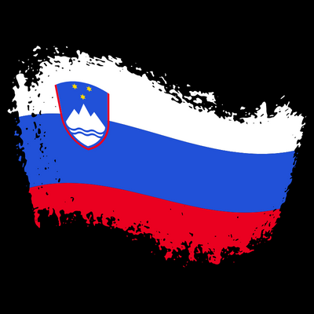
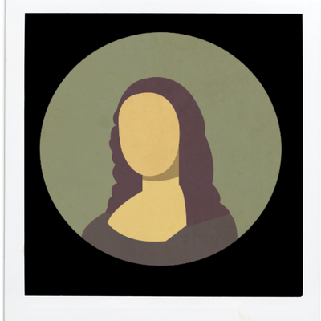
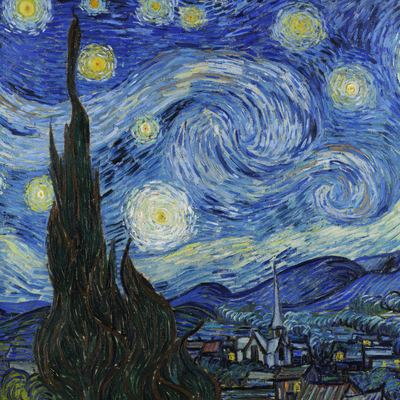

# ICFP Programming Contest 2022

Team `hayatox`'s repository for
[ICFP Programming Contest 2022](https://icfpcontest2022.github.io/).

# Members:

- Hayato Ito (hayato@google.com)

# Programming Languages

- Rust

# Results

- [result.json](./result.json)

## 画伯が書いた適当すぎる絵:

|   | お手本                         | 画伯                                          |
|---|--------------------------------|--------------------------------------------------|
| 1 |  |  |
| 2 |  |  |
| 7 |  |  |
| 9 |  |  |
| 13 |  |  |
| 15 |  |  |
| 16 |  |  |
| 17 |  |  |
